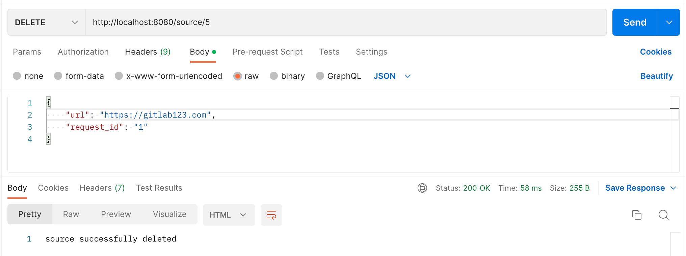

# Тестування працездатності системи

*В цьому розділі необхідно вказати засоби тестування, навести вихідні коди тестів та результати тестування.*

## GET запит на отримання всіх сутностей source

## GET запит на отримання сутності source

## POST запит на створення сутності source

## PUT запит на оновлення сутності source

## DELETE запит на видалення сутності source

